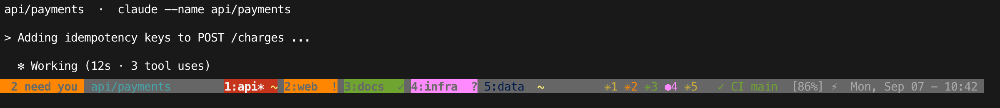

# tmux-agent-signal

See which tmux window has an AI coding agent that is **working**, **blocked on
you**, or **done**, straight from the window list in your status bar. Jump to
the next one that needs you with a key. No sidebar, no daemon, no polling.



Left: how many windows need you, and the Claude session in the active pane.
Middle: `2:web` is blocked on a permission (orange), `3:docs` finished while
you were elsewhere (green), `4:infra` is asking a question (pink), `1:api` and
`5:data` are working (`~`). Right: one glyph per agent with its window number.

State is written by the agent's own lifecycle hooks into tmux user options and
read natively by the status line. Nothing runs on redraw. Claude Code is wired
up out of the box; any agent with hooks or an extension API can report the
same three words.

## States

| State     | Badge | Tab colour | Meaning                                              |
|-----------|-------|------------|------------------------------------------------------|
| working   | `~`   | unchanged  | agent is running a turn                              |
| blocked   | `!`   | orange     | a permission prompt is waiting on a keypress          |
| ask       | `?`   | pink       | a question or plan approval is waiting on an answer   |
| done      | `✓`   | green      | finished since you last looked at that window        |
| idle      |       | unchanged  | at the prompt and you've seen it, or no agent here   |
| wait      | `…`   | dim        | you've flagged it: skip in `next` until it changes   |
| park      | `p`   | dim        | you've flagged it: skip in `next` until you unpark   |

`done` flips to idle automatically when you view the window. If a turn
finishes in the window you are already looking at, it never shows `done`.
A window with several agent panes shows the most urgent one
(blocked > ask > done > working). blocked and ask always show through a wait
or park.

Sounds play for blocked, ask and done, only when the window is not on screen.

**Fleet summary.** One entry per agent pane is prepended to `status-right`:
a glyph for the agent kind (`✳` Claude, `⬢` Codex, `π` Pi, `●` other)
followed by its window index, coloured by that pane's state, like
`✳1 ✳2 ✳4 ✳6`. The number is the window to jump to with `prefix + <index>`,
so an orange `✳4` means "window 4 needs you".

**Terminal title.** With `@agent_signal_title on`, tmux sets the outer
terminal's title to `[2 need you] session:window`, so iTerm2's tab shows the
count even when another app is in front.

## Keys (all `prefix +`, configurable)

| Key | Action |
|-----|--------|
| `N` | go to the next blocked window, else ask, else done |
| `A` | switcher popup: sessions > windows > panes with state (needs fzf) |
| `W` | toggle **wait** on the current window |
| `P` | toggle **park** on the current window |

Inside the switcher: `enter` go, `ctrl-x` close the selected pane, window or
session (asks first unless `@agent_signal_confirm_close off`), `ctrl-w` wait,
`ctrl-p` park, `esc` quit.

## Install

Requirements: tmux 3.1+ (pane options), `/bin/sh`. Optional: `jq` (hook JSON
parsing and the hook installer; without it a sed fallback is used),
`fzf` for the switcher, `afplay` (macOS) or `paplay` (Linux) for sounds.

With [tpm](https://github.com/tmux-plugins/tpm):

```tmux
set -g @plugin 'jward7/tmux-agent-signal'
```

then `prefix + I`. Put the line **after** any theme plugin so the badge is
appended to the theme's window format rather than overwritten.

If your plugin list lives in a file that tmux `if-shell`-sources, tpm cannot
see `@plugin` lines there; use the `@tpm_plugins` option instead (see
[Recommended setup](#recommended-setup)).

Without tpm, clone anywhere and add to the end of `~/.tmux.conf`:

```tmux
run-shell '/path/to/tmux-agent-signal/agent-signal.tmux'
```

### Claude Code hooks

Run once (needs `jq`; merges with any existing hooks and keeps a backup):

```sh
~/.tmux/plugins/tmux-agent-signal/bin/agent-signal install-claude-hooks
```

or copy [`docs/claude-hooks.json`](docs/claude-hooks.json) into
`~/.claude/settings.json` by hand. Then open `/hooks` in a running session, or
start a new one, so Claude reloads its config.

| Claude event                                  | State   |
|-----------------------------------------------|---------|
| `SessionStart`                                | idle, and pull the session name from Claude's registry |
| `UserPromptSubmit`, `PreToolUse`, `PostToolUse` | working |
| `PreToolUse` for AskUserQuestion or ExitPlanMode | ask |
| `PermissionRequest`, `Notification` permission_prompt | blocked |
| `Notification` elicitation, agent_needs_input | ask |
| `Notification` idle_prompt                    | done, but only if the pane is still marked working (a turn ended with Esc skips `Stop`). Otherwise ignored, since this fires a minute after every finish |
| `Stop` with no background tasks               | done    |
| `Stop` while a background task is still running | working, until a later `Stop` reports it finished |
| `SessionEnd`                                  | cleared |

Hooks are registered `async` so they never delay Claude. Each call is a
handful of tmux commands: on an 18-pane server one event costs about a dozen
tmux client calls, roughly half a second on a slow machine and much less on a
fast one. Updates to the same window are serialised with a lock, since Claude
runs hooks concurrently.

### Other agents

Any agent that can run a command on lifecycle events can report:

```sh
agent-signal set working|blocked|ask|done [pane-id]
agent-signal clear [pane-id]
```

The pane defaults to `$TMUX_PANE`, which tmux exports to every process in the
pane. Set `AGENT_KIND=codex` (or `pi`, `opencode`, ...) in the environment so
the switcher labels it. Pointers:

- **Codex CLI**: `hooks` in `~/.codex/config.toml`, map turn start/end and
  approval prompts to working/done/blocked.
- **Pi**: an extension on `agent_start`, `agent_settled` and
  `ui_prompt_start`, calling `agent-signal set` via child_process.
- **OpenCode**: a plugin on the equivalent events.

### Uninstall

```sh
~/.tmux/plugins/tmux-agent-signal/bin/agent-signal uninstall
```

removes the status-bar fragments, hooks, key bindings and any per-window or
per-pane state from the running server. Then drop the plugin line from your
tmux config and delete the `agent-signal` entries from the hooks block in
`~/.claude/settings.json`.

## Configuration

Set any of these in `tmux.conf` before the plugin loads.

```tmux
# Badges: "<icon> <fg> <bg>"; bg "default" leaves the tab colour alone
set -g @agent_signal_working '~ yellow default'
set -g @agent_signal_blocked '! black colour208'
set -g @agent_signal_ask     '? black colour213'
set -g @agent_signal_done    '✓ black green'
set -g @agent_signal_wait    '… colour245 default'
set -g @agent_signal_park    'p colour240 default'
set -g @agent_signal_tab_colour on        # off = badge only, never restyle the tab
set -g @agent_signal_ascii off            # on = plain ASCII defaults (+ . ?) for fonts without ✓ …

# Fleet summary glyphs and colours (status-right)
set -g @agent_signal_glyph_claude '✳'
set -g @agent_signal_glyph_codex  '⬢'
set -g @agent_signal_glyph_pi     'π'
set -g @agent_signal_glyph_other  '●'
set -g @agent_signal_colour_working yellow
set -g @agent_signal_colour_blocked colour208
set -g @agent_signal_colour_ask     colour213
set -g @agent_signal_colour_done    green
set -g @agent_signal_colour_idle    colour245

# Outer terminal title
set -g @agent_signal_title off            # on = set-titles with the needs-you count
set -g @agent_signal_title_format '#{?@agent_needs,[#{@agent_needs} need you] ,}#S:#W'

set -g @agent_signal_confirm_close on     # off = switcher closes without asking

# Sounds (macOS system sound names, or a file path; "off" to silence one)
set -g @agent_signal_sound on
set -g @agent_signal_sound_blocked Ping
set -g @agent_signal_sound_ask Ping
set -g @agent_signal_sound_done Glass

set -g @agent_signal_notify off           # on = desktop banner too (terminal-notifier, osascript, notify-send)
set -g @agent_signal_bell off             # on = also ring tmux's bell in the pane (monitor-bell, works over SSH)

# Keys ("" disables a binding)
set -g @agent_signal_key_next N
set -g @agent_signal_key_switcher A
set -g @agent_signal_key_wait W
set -g @agent_signal_key_park P
```

## Recommended setup

These are independent of the plugin but make the whole "many agents in tmux"
workflow hold together.

**Resume agents after a tmux restart.**
[tmux-resurrect](https://github.com/tmux-plugins/tmux-resurrect) and
[tmux-continuum](https://github.com/tmux-plugins/tmux-continuum) bring your
layout back, but a Claude pane comes back as a dead shell with the old
transcript painted in.
[tmux-assistant-resurrect](https://github.com/timvw/tmux-assistant-resurrect)
records each agent's session ID at save time and relaunches it with
`claude --resume <id>` on restore. It also supports Codex, Pi, Cursor,
Copilot, OpenCode and Grok. Needs `jq`.

```tmux
set -g @plugin 'tmux-plugins/tmux-resurrect'
set -g @plugin 'tmux-plugins/tmux-continuum'
set -g @plugin 'timvw/tmux-assistant-resurrect'
set -g @continuum-restore 'on'
```

Window state is not saved by resurrect. After a restore, badges reappear as
each agent's hooks fire again.

**Name your Claude sessions.** Claude Code sessions can message each other by
name (`/list-agents`, `SendMessage`). Derived names like `trade-39` are hard to
tell apart. Start sessions with `claude --name <repo>/<branch>` or `/rename`.
The plugin shows these names in the switcher. A shell function that does this
automatically:

```zsh
claude() {
  case " $* " in
    *" -n "*|*" --name "*|*" -r "*|*" --resume"*|*" -c "*|*" --continue "*) command claude "$@" ;;
    *) local root branch name
       if root=$(git rev-parse --show-toplevel 2>/dev/null); then
         branch=$(git rev-parse --abbrev-ref HEAD 2>/dev/null); name="${root:t}"
         [ -n "$branch" ] && [ "$branch" != main ] && [ "$branch" != master ] && name="$name/$branch"
       else name="${PWD:t}"; fi
       command claude --name "$name" "$@" ;;
  esac
}
```

**tmux settings Claude Code wants** (from its terminal docs):

```tmux
set -g allow-passthrough on          # desktop notifications and progress reach the outer terminal
set -s extended-keys on              # Shift+Enter
set -as terminal-features 'xterm*:extkeys'
set -g focus-events on
```

**Plugin list in an `if-shell`-sourced file.** tpm only follows plain
`source` lines when scanning for `@plugin`. If your local config is loaded via
`if-shell`, declare plugins with the option tpm reads from the server instead:

```tmux
set -g @tpm_plugins '           \
  tmux-plugins/tpm              \
  tmux-plugins/tmux-resurrect   \
  tmux-plugins/tmux-continuum   \
  timvw/tmux-assistant-resurrect \
  jward7/tmux-agent-signal      \
'
run -b '~/.tmux/plugins/tpm/tpm'
```

**Sounds over SSH.** Sounds play on the machine running tmux. For a remote
tmux, turn on `@agent_signal_bell` and let your terminal handle the bell, or
`@agent_signal_notify` with an OSC-aware terminal and `allow-passthrough`.

## How it compares

All of these are good projects under active development, so this is a
snapshot as of **2026-09-07**. 🟢 has it, 🟡 partial or optional, 🔴 does not,
▫️ not applicable. Corrections welcome.

| | tmux-agent-signal | [samleeney/tmux-agent-status](https://github.com/samleeney/tmux-agent-status) | [gentle-agent-state](https://github.com/Gentleman-Programming/gentle-agent-state) | [RatulMaharaj/tmux-agent-status](https://github.com/RatulMaharaj/tmux-agent-status) | [herdr](https://github.com/herdrdev/herdr) |
|---|---|---|---|---|---|
| Stays inside tmux | 🟢 | 🟢 | 🟢 also Zellij, Ghostty | 🟢 | 🔴 replaces tmux |
| State source | 🟢 hooks | 🟢 hooks | 🟢 hooks | 🔴 polls `ps` and screen text | 🟡 hooks for some agents, screen heuristics for Claude and Codex |
| No daemon or polling | 🟢 | 🔴 collector daemon | 🟢 | 🔴 3 s poller | ▫️ is the server |
| Works with no hooks installed | 🔴 | 🔴 | 🔴 | 🟢 | 🟢 |
| Per-window badge | 🟢 | 🟢 | 🟢 | 🟢 | ▫️ sidebar |
| Tab colour per state | 🟢 | 🔴 | 🔴 marker only | 🟢 | ▫️ |
| Question vs permission distinguished | 🟢 | 🟡 in an open PR | 🔴 | 🔴 | 🟢 |
| Done clears when viewed | 🟢 | 🟢 | 🔴 | 🟢 | 🟢 |
| Jump to next needing you | 🟢 | 🟢 | 🔴 | 🔴 | 🟢 |
| Wait / park triage | 🟢 | 🟢 | 🔴 | 🔴 | 🔴 |
| Switcher with close actions | 🟢 fzf popup | 🟢 sidebar + popup | 🔴 | 🔴 | 🟢 |
| Fleet summary in status bar | 🟢 | 🟢 | 🔴 | 🟡 badges only | 🟢 |
| Sounds | 🟢 | 🟢 | 🟢 | 🟢 | 🟢 |
| Background task awareness | 🟢 | 🟢 | 🔴 | 🔴 | ▫️ |
| Claude Code | 🟢 | 🟢 | 🟢 | 🟢 | 🟢 |
| Codex CLI | 🟡 generic entry, untested | 🟢 | 🟢 | 🟡 presence only | 🟢 |
| Pi / OpenCode | 🟡 generic entry, untested | 🔴 / 🔴 | 🟢 / 🟢 | 🔴 | 🟢 |
| Agent-to-agent API | 🔴 | 🔴 | 🔴 | 🔴 | 🟢 socket API |
| Survives lid close / restart without resume | 🔴 use resurrect | 🔴 | 🔴 | 🔴 | 🟢 |
| Tests in repo | 🟢 | 🟢 | 🟢 | 🔴 | 🟢 |
| Licence | MIT | none stated | MIT | MIT | Apache-2.0 |

If you want detection with nothing installed in the agent, or agents that talk
to each other, herdr is the right tool and this plugin is not trying to be it.
If you want to stay in your tmux setup with hooks doing the work, this plugin
is the smallest option that still covers triage and navigation.

## How it works

```
Claude hook ──> agent-signal hook Stop ──> tmux set -p @agent_state done
                                        └─> recompute window: @agent_state,
                                            @agent_icon, @agent_fg, window-status-style
                                        └─> not on screen? play sound
window-status-format reads #{@agent_icon} / #{@agent_fg}
after-select-window hook ──> agent-signal seen ──> done -> idle
```

Per-pane state lets several agents share a window. The window shows the most
urgent pane. Pane state is stored under `@agent_pane_state`, a different name
from the window's `@agent_state`, because pane options inherit from the window
in tmux formats and would otherwise read back the aggregate.

The plugin only ever touches a window's `window-status-style` when it set it,
tracked with `@agent_tab_owned`, so a style you or a theme put on a window
survives. Key bindings are skipped, with a message, when the key is already
bound to something else.

`agent-signal sync` reads Claude Code's own session registry
(`~/.claude/sessions/*.json`, which records each session's tmux pane and
display name) to label panes. It runs on `SessionStart`, when the plugin
loads, and when the switcher opens.

## Development

```sh
sh test/run.sh        # 80+ end-to-end checks on an isolated tmux server (-L agent-signal-test)
shellcheck -s sh bin/agent-signal scripts/switcher.sh agent-signal.tmux test/run.sh
sh docs/demo.sh       # throwaway server showing every state; tmux -L demo attach
```

CI runs both on Ubuntu and macOS.

## Troubleshooting

- **Nothing changes.** Run `agent-signal set blocked` inside a pane. If the tab
  changes, tmux is fine and the hooks are not firing: check
  `~/.claude/settings.json` and open `/hooks` in Claude to reload.
- **Copy-mode keys or plugin hooks stop working during a Homebrew tmux
  upgrade.** Homebrew unlinks `tmux` from `/usr/local/bin` while it builds.
  Plugins that shell out to `tmux` (tmux-yank, tmux-copycat) fail until it is
  relinked. This plugin looks for the Cellar binary as a fallback, so it keeps
  working. Wait for brew to finish, or `brew link tmux`.
- **Icons render as boxes or gaps.** Your font lacks ✓ or …. Set
  `@agent_signal_ascii on`, or give each state your own icon.
- **New windows or splits die instantly after a Homebrew tmux upgrade.** The
  new client cannot spawn panes on the old, still-running server. Save with
  resurrect, `tmux kill-server`, start tmux again, and let continuum restore.
- **The badge does not appear with a theme.** Load this plugin after the
  theme. The badge is appended to whatever `window-status-format` is set when
  the plugin loads.
- **`next` says nothing needs you** while a tab is orange or green: the
  window is on `wait` or `park`. `prefix + W` / `prefix + P` clears it.

## License

MIT
